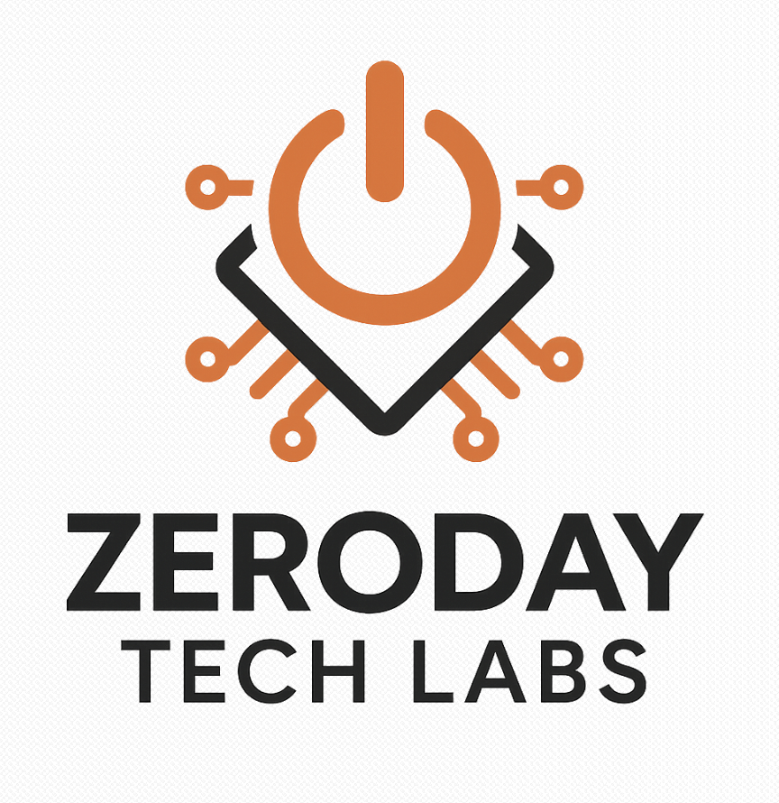

<p align="center">
  
</p>

<h1 align="center">ZeroDay Tech Labs</h1>

<p align="center">
  Cybersecurity Education • Case Studies • Practical Defense
</p>

<p align="center">
  
  
  
  
</p>

---

## 🔍 Overview

ZeroDay Tech Labs is a cybersecurity education platform focused on **practical, real-world learning** for households, students, and entry-level practitioners.

Instead of abstract theory, the platform translates real attack patterns into structured guidance through:

- Case studies  
- Toolkits  
- Applied scenarios  

The goal is to make cybersecurity **usable, not overwhelming**.

---

## 🧠 Core Areas

### 📁 Case Studies
Controlled, research-based simulations of real-world attack behavior.

Focus:
- Credential exposure (phishing)
- Malicious mobile applications
- Browser-based data disclosure

Each case study explains:
- How the exposure occurs  
- Evidence and observable behavior  
- Real-world impact  
- Defensive mitigation  

---

### 🧰 Toolkit
Downloadable, structured guides for immediate application.

Includes:
- Home network security  
- Account protection and MFA  
- Phishing detection and response  
- Backup and recovery  
- Family cybersecurity practices  

---

### 🌐 Resources
Curated official guidance from trusted cybersecurity organizations.

---

### 📊 Survey
Lightweight feedback system used to evaluate:
- user understanding  
- confidence improvement  
- educational effectiveness  

---

## ⚙️ Architecture

```text
Frontend  → GitHub Pages
Backend   → Vercel (Serverless)
AI        → OpenRouter (Hermes)
Domain    → Wix
